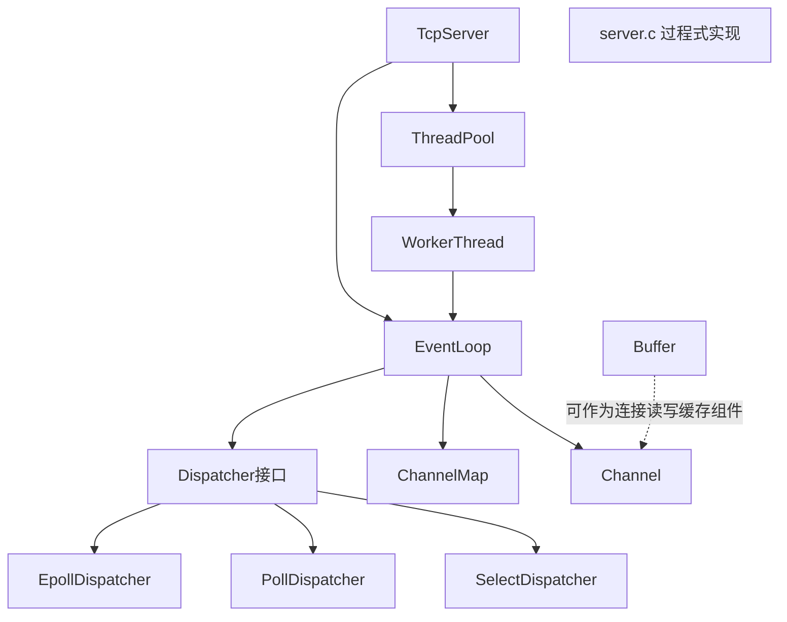
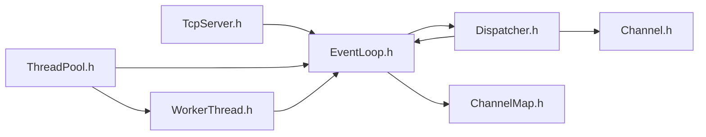

# simplehttp 架构与依赖关系分析（排除 `main` 与 `c_threadpool`）

> 分析范围：当前目录下除 `main.c`、`c_threadpool.c`、`c_threadpool.h` 之外的代码。\
> 目标：解释模块职责、相互依赖、处理流程、对应代码位置，以及可迁移的高级架构思想。

***

## 1. 先给结论：这个仓库里其实有“两套并存”的服务架构

当前代码并不是单一架构，而是并行存在两条路线：

1. **Reactor 模块化路线（更偏框架化）**\
   核心文件：`TcpServer.*`、`EventLoop.*`、`Dispatcher.h` + `Epoll/Poll/SelectDispatcher.c`、`ThreadPool.*`、`WorkerThread.*`、`Channel.*`、`ChannelMap.*`、`Buffer.*`
2. **过程式 epoll + 线程函数路线（更偏脚本式）**\
   核心文件：`server.c`、`server.h`

你会“绕”的核心原因之一：**两套模型都在目录里，命名风格和抽象层级也不同**，阅读时容易在“框架层”和“业务处理层”来回跳。

***

## 2. 模块职责图（按层次）

说明：

- 左侧 `TcpServer/EventLoop/Dispatcher/...` 是“可扩展网络框架”。
- 右下 `server.c` 是另一套“直接 epoll + 请求解析”的实现，不依赖上面的 Reactor 抽象。

***

## 3. 头文件依赖关系（编译期）

关键点：

- `Dispatcher.h` 与 `EventLoop.h` 是“抽象层中心”。
- `TcpServer.h` / `ThreadPool.h` 是“组装层”，不直接关心 epoll/poll/select 细节。

***

## 4. 运行时主流程（Reactor 路线）

### 4.1 启动阶段

1. `tecServerInit()`（`TcpServer.c`）\
   作用：创建 `TcpServer`，初始化监听器、主 `EventLoop`、线程池。
2. `eventLoopInitEx()`（`EventLoop.c`）\
   作用：绑定当前线程、初始化 `dispatcher`（当前默认 epoll）、初始化 `ChannelMap`、创建 `socketpair` 做线程唤醒。
3. `threadPoolRun()` + `workerThreadRun()`（`ThreadPool.c`/`WorkerThread.c`）\
   作用：启动 worker 线程，每个 worker 线程有自己的 `EventLoop`。

### 4.2 主循环阶段

1. `tcpServerRun()` 把监听 fd 封装成 `Channel` 加入主 loop。
2. `eventLoopRun()` 进入循环：
   - 调 `dispatcher->dispatch()` 等待 IO 事件
   - 调 `eventLoopProcessTask()` 消费任务队列（ADD/DELETE/MODIFY）
3. `EpollDispatcher` 在 `epoll_wait` 返回后，通过 `eventActivate()` 回调到 `Channel` 的 read/write handler。

### 4.3 跨线程投递任务

`eventLoopAddTask()` 是核心：

- 先把操作（ADD/DELETE/MODIFY）入队；
- 若调用线程就是 loop 所在线程，则直接处理；
- 否则通过 `socketpair` 写入唤醒消息，让目标 loop 从阻塞中返回并处理任务。

这就是典型的 **“任务队列 + 唤醒 fd”** 模式。

***

## 5. 运行时主流程（`server.c` 路线）

`server.c` 走的是“单文件过程式”链路：

1. `initListenFd()`：建监听 socket。
2. `epollRun()`：创建 epoll，把监听 fd 加入。
3. 事件到来：
   - 监听 fd：`acceptClient()` 建连并将 client fd 加入 epoll；
   - 客户端 fd：`recvHttpRequest()` 读取 HTTP 请求。
4. `parseRequestLine()` 解析请求行，按文件/目录决定：
   - `sendHeadMsg()` 回响应头
   - `sendFile()` 或 `sendDir()` 回包体

这条路线的优点是直观，缺点是复用性和可替换性较弱（与 Reactor 抽象耦合较少）。

***

## 6. 模块作用与对应代码速查

| 模块          | 主要文件                                             | 作用                          | 关键函数                                              |
| ----------- | ------------------------------------------------ | --------------------------- | ------------------------------------------------- |
| 服务器组装层      | `TcpServer.c/h`                                  | 组合监听器、主 loop、线程池，组织启动流程     | `tecServerInit`、`tcpServerRun`                    |
| 事件循环核心      | `EventLoop.c/h`                                  | 事件分发、任务队列、线程唤醒、channel 生命周期 | `eventLoopRun`、`eventLoopAddTask`、`eventActivate` |
| 事件后端策略      | `Dispatcher.h` + `Epoll/Poll/SelectDispatcher.c` | 屏蔽 `epoll/poll/select` 差异   | `add/remove/modify/dispatch`                      |
| fd 抽象       | `Channel.c/h`                                    | fd + 关心事件 + 回调函数的统一封装       | `channelInit`、`writeEventEnable`                  |
| fd 索引结构     | `ChannelMap.c/h`                                 | fd -> `Channel*` 映射，支持扩容    | `channelMapInit`、`makeMapRoom`                    |
| 线程池         | `ThreadPool.c/h`                                 | 管理 worker 线程，分配子 loop（轮询）   | `threadPoolRun`、`takeWorkerEventLoop`             |
| worker 线程   | `WorkerThread.c/h`                               | 每线程独立 `EventLoop`，并完成启动同步   | `workerThreadRun`                                 |
| 缓冲区         | `Buffer.c/h`                                     | 面向 socket 的动态读写缓冲           | `bufferSocketRead`、`bufferAppendData`             |
| 过程式 HTTP 服务 | `server.c/h`                                     | 直接 epoll + HTTP 静态文件处理      | `epollRun`、`recvHttpRequest`、`parseRequestLine`   |

***

## 7. 你可以这样理解“依赖方向”（避免再绕）

推荐用这条思维链看 C 架构：

1. **先看“对象关系”**：谁拥有谁（`TcpServer` 持有 `EventLoop`/`ThreadPool`）。
2. **再看“事件关系”**：谁驱动谁（`Dispatcher.dispatch` -> `eventActivate` -> `Channel callback`）。
3. **最后看“线程关系”**：谁在哪个线程执行（`EventLoop.threadID` + `socketpair` 唤醒机制）。

如果按这个顺序读，通常不会在函数细节里迷路。

***

## 8. 高级架构思想（可迁移到任何 C 网络项目）

1. **Reactor + Strategy（策略模式）组合**\
   `EventLoop` 只依赖 `Dispatcher` 接口，不绑定具体 IO 多路复用实现。\
   好处：可替换、可测试、可渐进优化。
2. **单线程 EventLoop + 多线程扩展（One Loop Per Thread）**\
   每个 loop 绑定一个线程，跨线程通过任务队列投递，而不是共享大量锁。\
   好处：降低竞态复杂度，性能更稳定。
3. **命令队列化（ADD/DELETE/MODIFY）**\
   把“对 epoll 的操作”抽象为命令入队，再由 loop 串行执行。\
   好处：状态一致性更容易保证。
4. **IO 与业务解耦（Channel 回调）**\
   fd 事件触发时，不直接写业务逻辑，而是调用回调。\
   好处：连接管理、协议解析、业务处理能拆层。
5. **组件可替换设计**\
   `Buffer`、`Dispatcher`、`ThreadPool` 都是可替换部件。\
   这是一种“在 C 里做模块化架构”的核心能力，而不是面向对象语法本身。

***

## 9. 当前代码里容易让人困惑的点（阅读时注意）

1. **两套架构并存**：`server.c` 与 Reactor 体系都在做网络服务，阅读时容易混线。
2. **命名有不一致**：如 `tecServerInit` / `ListenerInit` 与头文件声明不完全统一。
3. **部分组件像“半接入状态”**：例如 `Buffer` 在当前主链里还没有完整接线。
4. **默认后端固定 epoll**：虽有 `Poll/SelectDispatcher`，但初始化默认使用 `EpollDispatcher`。

这些点不是你“理解能力问题”，是代码演进阶段常见现象。

***

## 10. 建议你的阅读顺序（最省认知成本）

1. `TcpServer.h/.c`（看整体组装）
2. `EventLoop.h/.c`（看调度中枢）
3. `Dispatcher.h` + `EpollDispatcher.c`（看事件后端）
4. `Channel.h/.c` + `ChannelMap.h/.c`（看 fd 抽象与索引）
5. `ThreadPool.h/.c` + `WorkerThread.h/.c`（看多线程扩展）
6. `server.c`（作为另一套实现对照阅读）

***

## 11. 结构体字段与职责（你写代码时最该盯的“状态载体”）

下面这部分是“函数背后真正在传什么状态”，这是 C 架构理解的核心。

### 11.1 `struct TcpServer`（组装根对象）

字段（`TcpServer.h`）：

- `int threadNum`：期望 worker 线程数。
- `struct EventLoop* mainLoop`：主 Reactor（通常负责监听 fd 和调度）。
- `struct ThreadPool* threadPool`：worker 管理器。
- `struct Listener* listener`：监听 socket 容器（`lfd + port`）。

职责：

- 把“监听、调度、线程”三件事组装到一个对象里，作为服务启动入口。

对应 `server.c` 的直观对照：

- `server.c` 里这些状态是散落的局部变量（`lfd`、`epfd` 等）。
- 在 Reactor 路线中它们被收敛成一个顶层对象，避免“变量到处飘”。

### 11.2 `struct EventLoop`（Reactor 中枢）

字段（`EventLoop.h`）：

- `bool isQuit`：循环退出标志。
- `struct Dispatcher* dispatcher` / `void* dispatcherData`：后端接口与其私有数据（epoll/poll/select）。
- `struct ChannelElement* head/tail`：任务队列（ADD/DELETE/MODIFY）。
- `struct ChannelMap* channelMap`：`fd -> Channel*` 的快速索引。
- `pthread_t threadID` / `char threadName[32]`：loop 线程绑定信息。
- `pthread_mutex_t mutex`：保护任务队列等共享状态。
- `int socketPair[2]`：跨线程唤醒通道（写端唤醒，读端消费）。

职责：

- 串行化事件处理；屏蔽后端 IO 多路复用细节；承接跨线程任务投递。

对应 `server.c` 的直观对照：

- `server.c` 的 `epoll_wait + epoll_ctl + 回调分发` 被统一抽象进 `EventLoop`。
- `server.c` 里没有“统一任务队列 + 唤醒机制”，而是直接在线程函数里操作 epoll。

### 11.3 `struct Dispatcher`（后端策略接口）

字段（`Dispatcher.h`）：

- `init/add/remove/modify/dispatch/clear` 函数指针集合。

职责：

- 定义“事件后端能力协议”；`EventLoop` 只依赖协议，不依赖具体实现。

对应 `server.c` 的直观对照：

- `server.c` 把后端固定死为 epoll。
- Reactor 路线把 `epoll` 抽象成 `EpollDispatcher`，未来可以切 `poll/select`。

### 11.4 `struct Channel`（fd 行为对象）

字段（`Channel.h`）：

- `int fd`：文件描述符。
- `int events`：关注的事件位（读/写）。
- `handleFunc readCallback/writeCallback`：读写事件回调。
- `void* arg`：回调上下文参数。

职责：

- 把“fd + 事件 + 处理逻辑”绑定在一起，变成可调度单元。

对应 `server.c` 的直观对照：

- `server.c` 使用 `if (fd == lfd) accept else recv` 的分支判断。
- Reactor 把“如何处理这个 fd”内聚到 `Channel` 回调，不再到处写分支。

### 11.5 `struct ChannelMap`（fd 索引）

字段（`ChannelMap.h`）：

- `int size`：当前容量。
- `struct Channel** list`：按 fd 下标索引到 channel。

职责：

- 在 `eventActivate(fd)` 时 O(1) 找到目标 `Channel`。

对应 `server.c` 的直观对照：

- `server.c` 依赖 epoll 返回的 fd 后直接分支。
- Reactor 引入 map 统一管理 fd 生命周期与回调归属。

### 11.6 `struct ThreadPool` 与 `struct WorkerThread`（并发扩展）

`ThreadPool` 字段：

- `bool isStart`：是否已启动。
- `struct EventLoop* mainLoop`：主 loop 引用。
- `int threadNum`：线程数。
- `struct WorkerThread* workerThreads`：worker 数组。
- `int index`：轮询分配游标。

`WorkerThread` 字段：

- `pthread_t threadID`：线程 id。
- `char name[24]`：线程名。
- `pthread_mutex_t mutex` / `pthread_cond_t cond`：启动同步。
- `struct EventLoop* evLoop`：该 worker 持有的子 loop。

职责：

- 形成 One-Loop-Per-Thread 模型；每个 worker 自己跑事件循环。

对应 `server.c` 的直观对照：

- `server.c` 是“事件来了就创建线程处理”的风格。
- Reactor 路线是“线程先建好、loop 常驻”，更接近高并发服务器设计。

### 11.7 `struct Buffer`（数据平面缓冲）

字段（`Buffer.h`）：

- `char* data`：底层缓冲区。
- `int capacity`：总容量。
- `int readPos` / `int writePos`：读写游标。

职责：

- 管理 socket 读写缓存，支持扩容与拼接。

对应 `server.c` 的直观对照：

- `server.c` 目前主要用栈数组拼包。
- `Buffer` 是为后续“连接态、分段包、粘包处理”准备的抽象层。

***

## 12. `server.c` 每一步，对应在 Reactor 里被抽象成了什么

> 你可以把这节当“迁移地图”：从过程式写法迁到框架写法时，每一步该放到哪个抽象里。

### 步骤 1：创建监听 socket

`server.c`：

- `initListenFd(port)` 完成 `socket -> setsockopt -> bind -> listen`。

Reactor 抽象：

- 对应 `Listener` + `listenerInit()`（`TcpServer.c`），再挂到 `TcpServer.listener`。

抽象收益：

- 监听资源从“函数局部变量”提升为“服务器对象状态”。

### 步骤 2：创建 epoll 并上树监听 fd

`server.c`：

- `epfd = epoll_create(1)`，`epoll_ctl(ADD, lfd)`。

Reactor 抽象：

- `eventLoopInitEx()` 内部 `dispatcher->init()` 创建后端。
- `tcpServerRun()` 里把 `lfd` 封成 `Channel`，通过 `eventLoopAddTask(..., ADD)` 入队。

抽象收益：

- “上树动作”不再直接 `epoll_ctl`，而由统一 `ADD` 命令驱动。

### 步骤 3：阻塞等待事件

`server.c`：

- `epoll_wait` 在 `epollRun()` 主循环里直接调用。

Reactor 抽象：

- `eventLoopRun()` 统一驱动 `dispatcher->dispatch(timeout)`。

抽象收益：

- 主循环不关心后端是 epoll 还是 poll/select。

### 步骤 4：根据 fd 分流（监听 fd / 客户端 fd）

`server.c`：

- `if (fd == lfd) acceptClient else recvHttpRequest`。

Reactor 抽象：

- 在 `Channel` 层提前绑定回调；
- 事件触发后 `eventActivate()` 直接调对应 callback。

抽象收益：

- 从“运行时 if/else 分流”变成“注册期绑定行为”。

### 步骤 5：接受新连接并把 cfd 再上树

`server.c`：

- `acceptClient()` 里 `accept`、非阻塞、`epoll_ctl(ADD, cfd)`。

Reactor 抽象（目标设计）：

- 监听 `Channel` 的 read callback 做 `accept`；
- 为 `cfd` 创建 `Channel`；
- 选一个 worker loop（`takeWorkerEventLoop`）；
- `eventLoopAddTask(workerLoop, cfdChannel, ADD)` 交给目标线程处理。

当前状态提示：

- 这条链在仓库里还没完全接完（你也已经说明了正在慢慢写）。

### 步骤 6：读取 HTTP 请求并解析

`server.c`：

- `recvHttpRequest()` -> `parseRequestLine()` -> `sendHeadMsg/sendFile/sendDir`。

Reactor 抽象（目标设计）：

- 读取与连接状态放在 `Channel.readCallback`；
- 包解析/业务逻辑放协议层或 handler 层；
- 发送时可借助 `Buffer` + `WriteEvent` 做异步回写。

抽象收益：

- IO 管理与 HTTP 业务逻辑可以分层，不再互相缠绕。

***

## 13. 事件调用链（你最关心的“别绕”版）

### 13.1 当前仓库里“已落地”的 Reactor 调用链

1. `tcpServerRun`
2. `threadPoolRun`
3. `channelInit(lfd, ReadEvent, acceptConnection, ...)`
4. `eventLoopAddTask(mainLoop, lfdChannel, ADD)`
5. `eventLoopRun(mainLoop)` 循环
6. `dispatcher->dispatch`（当前默认 `EpollDispatcher`）
7. `eventActivate(mainLoop, lfd, ReadEvent)`
8. `acceptConnection(...)`（当前函数尚未完成后续分发）

理解重点：

- 框架骨架已经成立：`dispatch -> activate -> callback`。
- “accept 后如何把连接交给 worker + HTTP 处理”这段仍在补全中。

### 13.2 `server.c` 的完整调用链（直观对照）

1. `initListenFd`
2. `epollRun`
3. `epoll_wait`
4. 分支：
   - 监听事件：`acceptClient` -> `epoll_ctl(ADD, cfd)`
   - 客户端事件：`recvHttpRequest` -> `parseRequestLine`
5. 业务回包：
   - `sendHeadMsg`
   - `sendFile` / `sendDir`

理解重点：

- 这条链更“能跑起来”，但逻辑在单文件聚集，扩展时容易越写越乱。

### 13.3 你后续实现时推荐的“目标调用链”（按现有抽象）

1. 主 loop 监听 `lfd`。
2. `lfd` 可读 -> `accept` 新 `cfd`。
3. 选择 worker：`takeWorkerEventLoop`。
4. 创建连接对象（建议含 `cfd + Buffer + 状态`）并绑到 `Channel.arg`。
5. 投递 `ADD` 到 worker loop。
6. worker loop 收到读事件 -> 读入 `Buffer` -> 解析请求。
7. 生成响应，必要时开启 `WriteEvent` 分段发送。
8. 完成后 `DELETE` channel 并释放连接资源。

这条链的好处：

- 每个步骤都有明确“归属模块”，不会再把所有逻辑塞进一个函数里。

***

## 14. 一句话抓手（写代码前先看）

- `server.c` 的每个“直接系统调用步骤”，在 Reactor 里都应对应“一个抽象层职责 + 一次任务投递/回调触发”。
- 你只要坚持“状态进结构体、流程进回调、跨线程走任务队列”，代码就会越来越清晰，而不是越来越乱。

